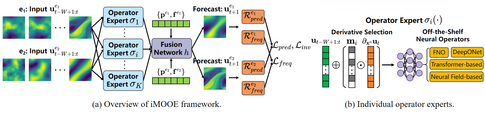

# Towards Generalizable PDE Dynamics Forecasting via Physics-Guided Invariant Learning [ICLR 2026]
This repository is the official PyTorch implementation of iMOOE, which is built upon the defined two-fold PDE invariance principle and capable of achieving zero-shot OOD generalization for PDE dynamics forecasting.

<p float="center">
  
</p>

# 1. PDE Data Generation
Run `dr.py` and `ns.py` in `datasets/` folder to simulate multi-environment PDE trajectories of Diffusion-Reaction and Navier-Stokes equations, where hyperparameter `num_env_train, num_env_test` determine the number of training and ID/OOD testing environments, `n_data_per_env_train, n_data_per_env_test` determine the number of PDE trajectories under each physical environment.

# 2. Execute iMOOE Method
Run `exp_moe_train.py` and `exp_moe_test.py` to reproduce the iMOOE model on each PDE dataset. Every experiment can be independently manipulated by both `dr.yaml, ns.yaml` in `configs/` folder and training/testing arguments in these two `.py` files.

# 3. Citation
```
@article{li2025towards,
  title={Towards Generalizable PDE Dynamics Forecasting via Physics-Guided Invariant Learning},
  author={Li, Siyang and Chen, Yize and Guo, Yan and Huang, Ming and Xiong, Hui},
  journal={arXiv preprint arXiv:2509.24332},
  year={2025}
}
```
